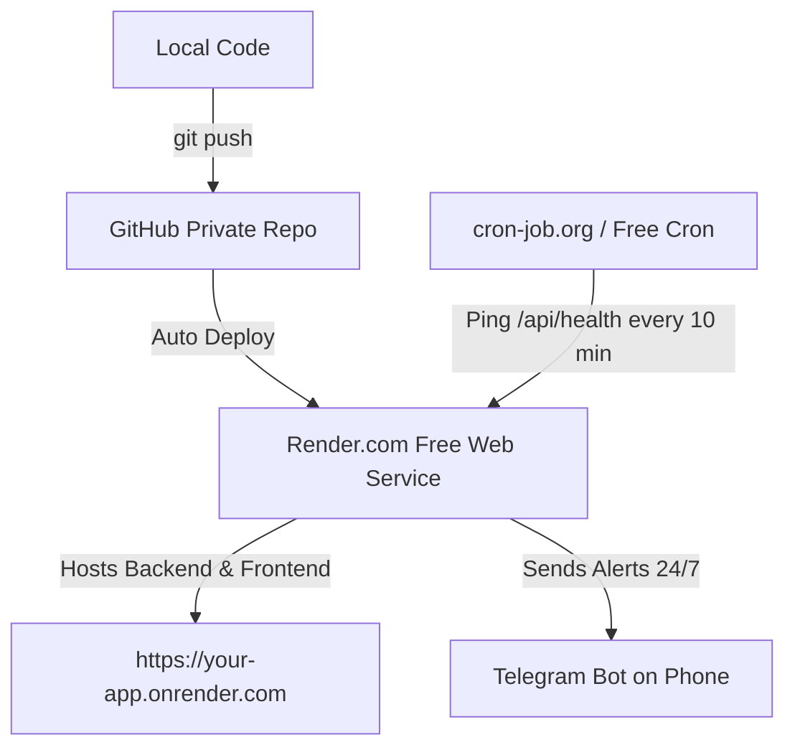

# 🌐 Cloud Deployment Guide (100% Free)
### GitHub + Render.com + Cron-Job.org Keep-Alive

This guide walks you step-by-step through deploying your **XAU/USD Pro Trading Dashboard & Alerting Engine** to the cloud for free with 24/7 uptime.

---

## 📋 Overview of Architecture



- **Single Service Architecture**: Express serves both the REST API, Socket.io WebSocket connections, and the compiled React production frontend from `dist/`.
- **Render.com Free Tier**: Provides 750 free instance hours/month.
- **Cron-Job.org**: Pings `/api/health` every 10 minutes so Render never goes into idle sleep.

---

## Part 1: Commit and Push to GitHub

### Step 1: Open PowerShell in your project root
```powershell
cd "c:\Users\farha\Documents\xauusd pro final"
```

### Step 2: Initialize Git Repository
```powershell
git init
git add .
git commit -m "feat: XAU/USD Pro trading dashboard with dynamic market structure, expandable news cards, and settings panel"
```

*(Note: `.gitignore` is already configured to keep your `.env` secret file private and safe!)*

### Step 3: Create a New GitHub Repository
1. Go to **[github.com/new](https://github.com/new)**.
2. Repository Name: `xauusd-pro` (or any name you prefer).
3. Set to **Private** (recommended to keep your project proprietary).
4. Click **Create repository**.

### Step 4: Link and Push
Run these commands in your PowerShell (replace `YOUR_USERNAME` with your GitHub username):
```powershell
git branch -M main
git remote add origin https://github.com/YOUR_USERNAME/xauusd-pro.git
git push -u origin main
```

---

## Part 2: Deploy to Render.com (Free)

### Step 1: Create a Render Account
Go to **[render.com](https://render.com)** and sign up / log in with your GitHub account.

### Step 2: Create a New Web Service
1. In the Render dashboard, click **New +** → **Web Service**.
2. Select **Build and deploy from a Git repository**.
3. Connect your GitHub account and select your `xauusd-pro` repository.

### Step 3: Configure Build & Start Settings
Fill in the form with these exact settings:
- **Name:** `xauusd-pro` (or your chosen name)
- **Region:** Frankfurt (EU) or Oregon (US)
- **Branch:** `main`
- **Root Directory:** *(leave blank)*
- **Runtime:** `Node`
- **Build Command:**
  ```bash
  npm install && npm run build
  ```
- **Start Command:**
  ```bash
  npm start
  ```
- **Instance Type:** `Free` ($0/month)

### Step 4: Add Environment Variables
Scroll down to the **Environment Variables** section and add:

| Key | Value | Notes |
|---|---|---|
| `NODE_ENV` | `production` | Enables production static file serving |
| `PORT` | `10000` | Render default port |
| `OPENROUTER_API_KEY` | `sk-or-v1-19aca...` | Your OpenRouter API Key |
| `TELEGRAM_BOT_TOKEN` | `8740241454:AAHy...` | Your Telegram Bot Token |
| `TELEGRAM_CHAT_ID` | `5300822536` | Your Telegram Chat ID |
| `GOOGLE_API_KEY` | *(optional)* | Your Gemini API Key |

### Step 5: Deploy
Click **Create Web Service**. 
Render will now clone your code, run `npm install`, build the Vite frontend, and launch the server. Within 2-3 minutes, your live URL will be active (e.g., `https://xauusd-pro.onrender.com`).

---

## Part 3: Keep 24/7 Alive via Free CronJob

Render free instances spin down (sleep) after 15 minutes of inactivity. To keep your price polling, news analysis, and Telegram alerts running 24/7 with zero downtime:

### Option A: Using cron-job.org (Recommended & Easiest)
1. Go to **[cron-job.org](https://cron-job.org)** and create a free account.
2. Click **Create Cronjob**.
3. **Title:** `XAU/USD Pro Heartbeat`
4. **URL:** `https://your-app-name.onrender.com/api/health`
5. **Execution Schedule:** Every **10 minutes** (`*/10 * * * *`).
6. Click **Create**.

Whenever this ping hits your service every 10 minutes, it keeps the server running continuously without ever sleeping!

### Option B: Using GitHub Actions Workflow (Self-Contained)
Alternatively, you can create a `.github/workflows/keepalive.yml` in your repo:
```yaml
name: Keepalive Ping
on:
  schedule:
    - cron: '*/12 * * * *'
  workflow_dispatch:

jobs:
  ping:
    runs-on: ubuntu-latest
    steps:
      - name: Ping Health Endpoint
        run: curl -sSf https://your-app-name.onrender.com/api/health
```

---

## Part 4: Updating Your App in Future

Whenever you make changes to your dashboard in the future, simply run:
```powershell
git add .
git commit -m "update: improvements"
git push
```
Render will automatically detect the push, rebuild, and redeploy with zero downtime!
